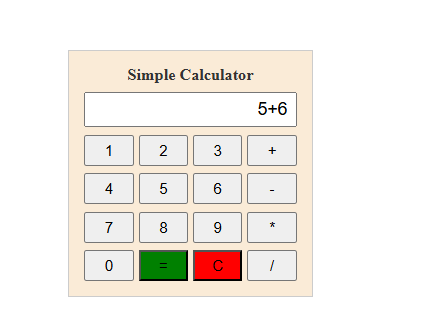
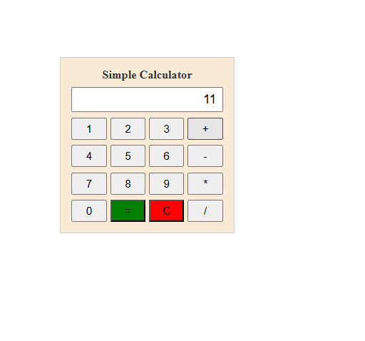

# Ex.No:06 JavaScript Calculator
## Date:
## AIM

To design and develop a simple calculator using HTML, CSS, and JavaScript to perform basic arithmetic operations such as addition, subtraction, multiplication, and division.

## ALGORITHM

1. Create an HTML page to design the calculator interface.
2. Create a display field to show the numbers and calculation results.
3. Create buttons for digits from 0 to 9 and arithmetic operators.
4. Use CSS to arrange and style the calculator buttons and display.
5. Write JavaScript functions to handle button clicks.
6. Store the entered numbers and operators in the calculator display.
7. Use JavaScript to evaluate the arithmetic expression.
8. Display the calculated result on the calculator screen.
9. Provide a clear button to reset the calculator.
10. Test the calculator with different arithmetic operations.

## PROGRAM
~~~
<!DOCTYPE html>
<html lang="en">
<head>
    <title>Simple Calculator</title>
    
</head>
<body>

    

        
Simple Calculator

   
        <input type="text" name="calc" id="calc">

        

            <input type="button" value="1" onclick="calc.value+='1'">
            <input type="button" value="2" onclick="calc.value+='2'">
            <input type="button" value="3" onclick="calc.value+='3'">
            <input type="button" value="+" onclick="calc.value+='+'">
        

        

            <input type="button" value="4" onclick="calc.value+='4'">
            <input type="button" value="5" onclick="calc.value+='5'">
            <input type="button" value="6" onclick="calc.value+='6'">
            <input type="button" value="-" onclick="calc.value+='-'">
        

        

            <input type="button" value="7" onclick="calc.value+='7'">
            <input type="button" value="8" onclick="calc.value+='8'">
            <input type="button" value="9" onclick="calc.value+='9'">
            <input type="button" value="*" onclick="calc.value+='*'">
        

        

            <input type="button" value="0" onclick="calc.value+='0'">
            <input type="button" value="=" onclick="calc.value=eval(calc.value)">
            <input type="button" value="C" onclick="calc.value=''">
            <input type="button" value="/" onclick="calc.value+='/'">
        

    

</body>
</html>
~~~

## OUTPUT

## RESULT

Thus, a JavaScript-based calculator was successfully designed and developed to perform basic arithmetic operations using HTML, CSS, and JavaScript.
